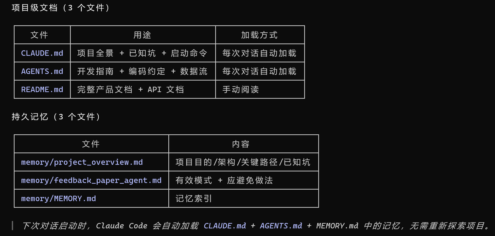
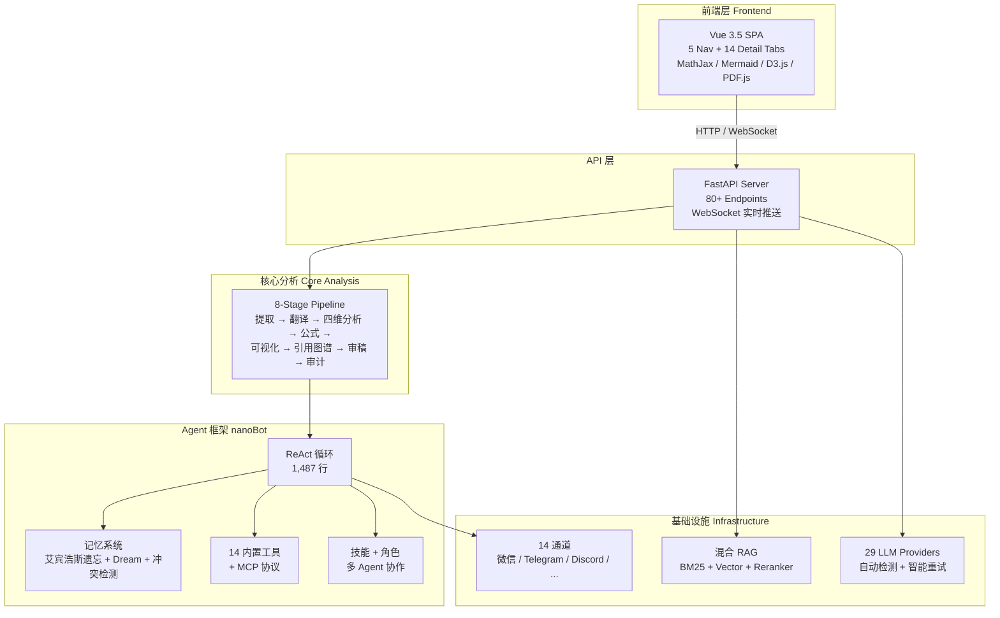

# 🔬 Silver Research Bot

> **上传 PDF → 全自动 8 阶段深度分析 → 可视化报告 — 不只是摘要，而是学术级的理解。**
>
> **Upload a PDF → Full 8-stage Deep Analysis → Visual Report — Not just a summary, but scholarly understanding.**

[](https://www.python.org/downloads/)
[](LICENSE)
[](https://pypi.org/project/silver-research-bot-ai/)
[](https://silver-research-bot.wiki)
[](web/)
[](CONTRIBUTING.md)

---

## 🤔 为什么选择 Silver Research Bot？

| ❌ 痛点 | ✅ Silver Research Bot 的解决方案 |
|---|---|
| ChatPDF / Claude 只能浅层总结论文，缺乏数学深度 | **8 阶段 Pipeline** 提取、翻译、四维并行分析、逐条公式解读、架构可视化、质量审计 |
| 读英文论文（ML、UAV、通信等）每篇需要数小时 | **LaTeX 保护翻译** 保留每个公式为 `$...$` / `$$...$$` 格式，翻译后从译文中重建完整公式——数学符号不损坏 |
| PDF 公式提取常遗漏行内数学、多行方程、编码字符 | **5 规则公式过滤器** + 边界扩展 + 80+ Unicode→LaTeX 映射 + 双下标合并 |
| 想对比 3+ 篇论文，但手动交叉引用太繁琐 | **LLM 增强横向对比** + D3.js 力导向引用图谱（论文/基础/对比/背景四类节点） |
| 想复现论文算法，但缺少实现时间 | **自主研究引擎**：自然语言描述 → 代码生成 → CPU 执行 → 指标提取 → LaTeX 论文草稿 |
| 需要在中国消息平台（微信、钉钉、飞书）上部署 AI Agent | **14 个内置聊天通道**：微信、企业微信、钉钉、飞书、QQ + Telegram、Discord、Slack、WhatsApp 等 |
| 构建有持久记忆的 AI Agent 基础设施复杂 | **完整 nanoBot Agent 框架**：ReAct 循环、艾宾浩斯遗忘曲线记忆（7 天半衰期）、Dream 后台整合、冲突检测、Git 版本化记忆 |

---

## 📑 目录

- [演示](#-演示)
- [快速开始](#-快速开始)
- [功能全景](#-功能全景)
  - [论文分析 (8 阶段)](#1-论文分析-8-阶段)
  - [自主研究引擎](#2-自主研究引擎)
  - [Agent 框架 (nanoBot 核心)](#3-agent-框架-nanobot-核心)
  - [RAG 与基础设施](#4-rag-与基础设施)
- [架构图](#-架构图)
- [Pipeline 流程](#-pipeline-流程)
- [数据一览](#-数据一览)
- [安装与配置](#-安装与配置)
- [API 参考](#-api-参考)
- [技术栈](#-技术栈)
- [文档](#-文档)
- [社区与贡献](#-社区与贡献)
- [许可证与引用](#-许可证与引用)
- [项目结构](#-项目结构)

---

## 🎬 演示

### Agent 对话界面



### 前端一览

- **5 个导航标签**: Agent 对话 | 论文研读 | 文献 RAG | 阅读历史 | 研究趋势
- **14 个详情标签**: 翻译 / 系统模型 / 问题表述 / 优化算法 / 实验设计 / 公式解读 / 可视化 / 引用图谱 / 审稿 / 审计 / PDF 阅读器 / 问答 / 对比 / 导出
- **3 个 D3.js 数据图**: 柱状图 + 热力图 + 折线图，展示研究趋势
- **i18n**: 中文 / English 一键切换

---

## 🚀 快速开始

### pip 安装（推荐）

```bash
pip install silver-research-bot-ai
cp .env.example .env          # 编辑填入 API Key
uvicorn silver_research_bot.research_app:app --port 8765
```

### 源码安装

```bash
git clone https://github.com/HKUDS/silver-research-bot
cd silver_research_bot
pip install -e ".[dev]"
cp .env.example .env
uvicorn silver_research_bot.research_app:app --reload --port 8765
```

### 启动前端

```bash
cd web && npm install && npm run dev
# 浏览器访问 http://localhost:5173
```

### Docker

```bash
docker build -t silver-research-bot .
docker run -p 8765:8765 --env-file .env silver-research-bot
```

---

## 🧩 功能全景

### 1. 论文分析 (8 阶段)

| 阶段 | 功能 | 描述 | 产物 |
|------|------|------|------|
| **0. 提取** | PDF 解析 | PyMuPDF 解析 + 原图提取 (xref) + 80+ Unicode→LaTeX + 5 规则公式过滤 | `extracted.json` |
| **1a. 翻译** | 分块翻译 | 2000 字/块 + `<FORMULA_i>` 占位符保护 LaTeX + 动态 max_tokens + 2 级截断重试 | `translation.md` |
| **1b. 四维分析** | 并行深度分析 | `asyncio.gather` 并行执行：系统模型 \| 问题表述 \| 优化算法 \| 实验设计 | 4 个 `.md` 文件 |
| **2. 公式解读** | 四级解释卡片 | 批量 LLM 生成 HTML 卡片：符号定义 → 数学含义 → 领域语境 → 关联关系 | `formula_explanations.md` |
| **3. 可视化** | Mermaid 图表 | LLM 生成架构图 + 流程图 + 实验表格，程序化卡片渲染 | `analysis_visualization.html` |
| **4a. 引用图谱** | D3.js 力导向图 | LLM 提取引用 → 4 类节点（论文/基础/对比/背景）→ D3.js 交互式渲染 | `citation_graph.html` |
| **4b. 三视角审稿** | A/B 审稿 | 理论家 \| 工程派 \| 领域专家 三视角并行独立评审 | 3 个 `review_*.md` |
| **5. 质量审计** | 完整性检查 | 结构检查 + LLM 深度审计（严重/一般/建议分级）+ 可视化仪表板 | `audit_report.json` |

### 2. 自主研究引擎

| 功能 | 描述 |
|------|------|
| **自然语言→代码** | 用自然语言描述实验 → 自动生成 Python 代码 |
| **CPU 执行** | `subprocess` 沙箱执行，含超时 + 日志 |
| **指标提取** | 自动解析 stdout 提取准确率、损失、F1 等指标 |
| **LaTeX 草稿** | 基于真实实验数据生成论文草稿（Introduction / Method / Results / Discussion） |
| **批量实验** | 多 seed、多 epoch 网格搜索，含审计追踪 |
| **审计事件流** | 每步记录：代码生成 → 执行 → 指标 → 产物，完整可追溯 |

### 3. Agent 框架 (nanoBot 核心)

| 分类 | 特性 | 详情 |
|------|------|------|
| **核心循环** | ReAct 循环 | 1,487 行 AgentLoop：LLM ↔ Tool 交替 + 中轮注入 + 崩溃恢复 + 流式输出 |
| | 并发控制 | `asyncio.Semaphore(3)` 全局 + `asyncio.Lock` 会话级串行保证 |
| | Token 管理 | 接近上下文窗口时自动压缩，边界感知的块选择 |
| **记忆系统** | 艾宾浩斯遗忘曲线 | `R = e^(-t/S)`，半衰期 7 天，1-10 重要性评分 |
| | Dream 后台整合 | 两阶段处理：Phase1 LLM 分析 → Phase2 AgentRunner 编辑记忆文件 |
| | 语义冲突检测 | 矛盾 / 重复 / 更新三种模式的语义检测 |
| | 主动检索 | 每轮对话注入 Top-K 相关记忆 |
| | Git 版本化 | Dream 整合时自动 git commit MEMORY.md / SOUL.md / USER.md |
| | 三层架构 | Active（每轮注入）→ Project（跨会话共享）→ Long-term（持久归档） |
| **内置工具** | 14 个工具 | `paper_search` (arXiv/PubMed/SemanticScholar/DBLP 并行)、`web_search`、`web_fetch`、`read_file`、`write_file`、`edit_file`、`list_dir`、`exec`、`glob`、`grep`、`message`、`spawn`、`notebook_edit`、`cron` |
| | MCP 客户端 | 完整的 Model Context Protocol 支持，接入外部工具服务器 |
| **技能系统** | 动态加载 | 技能热加载 + `skill-creator` 元技能，按需扩展 Agent 能力 |
| **角色工厂** | 5 预定义 + 自定义 | paper_reviewer / code_reviewer / literature_review / translator / formula_expert + SOUL.md 自定义，每个角色绑定专属 tools + temperature |
| **多 Agent 协作** | PaperAnalysisTeam | Translator + Analyzer + Auditor 通过 MessageBus 异步协同 |

### 4. RAG 与基础设施

| 分类 | 特性 | 详情 |
|------|------|------|
| **混合 RAG** | BM25 + 向量 + 重排序 | 0.3×BM25 + 0.7×向量加权融合 → Cross-Encoder 重排至 Top-5 |
| | 多模态过滤 | text / formula / figure / table 标签级过滤 |
| | 零外部依赖 | 纯 numpy 文件向量存储，无需 Pinecone / Weaviate / Milvus |
| | 增量 CRUD | 新增 / 更新 / 删除 (tombstone 软删除) / 全量重建索引 |
| **LLM 提供商** | 29 个 Provider | OpenAI、Anthropic、DeepSeek、Gemini、Groq、Mistral、智谱 (GLM)、通义 (Qwen)、月之暗面 (Kimi)、MiniMax、阶跃星辰、硅基流动、火山引擎、BytePlus、百度千帆、小米 MIMO、OpenRouter、AiHubMix、Ollama、vLLM、LM Studio、OpenVINO、Azure OpenAI、OpenAI Codex、GitHub Copilot + 自定义端点 |
| | 自动检测 | 通过模型名关键词 / API Key 前缀 / base URL 子串自动匹配 Provider |
| | 智能重试 | 指数退避 (1/2/4s)，429 限流 vs 配额耗尽分类处理，图片降级回退 |
| **通信通道** | 14 个平台 | 微信、企业微信、钉钉、飞书、QQ、Telegram、Discord、Slack、WhatsApp、Matrix、MoChat、Email、Microsoft Teams、WebSocket |
| **前端** | Vue 3.5 SPA | 单文件 SPA (~1,500 行)，深色科技风 CSS (~800 行)，CDN 全依赖（MathJax 3 / Mermaid 10 / D3.js v7 / PDF.js v3.11） |

---

## 🏗 架构图



---

## 🔄 Pipeline 流程


---

## 📊 数据一览

| 指标 | 数值 |
|------|------|
| **论文分析深度** | 8 个阶段，非单一摘要 |
| **分析维度** | 4 维并行（系统模型 / 问题 / 算法 / 实验） |
| **审稿视角** | 3 视角并行（理论家 / 工程派 / 领域专家） |
| **LLM 提供商** | 29（OpenAI / Anthropic / DeepSeek / 智谱 / 通义 / Kimi / Gemini / Groq / Mistral + 21 更多） |
| **聊天通道** | 14（微信 / 企业微信 / 钉钉 / 飞书 / QQ / Telegram / Discord / Slack / WhatsApp / Matrix / MoChat / Email / MS Teams / WebSocket） |
| **内置 Agent 工具** | 14 + MCP 协议支持 |
| **记忆半衰期** | 7 天（艾宾浩斯曲线：R = e^(-t/S)） |
| **RAG 检索** | BM25 + Vector + Cross-Encoder 三级混合 |
| **前端依赖** | 0（全部 CDN：MathJax / Mermaid / D3.js / PDF.js） |
| **API 端点** | 80+（论文 / RAG / 研究实验 / Agent / 趋势 / 历史） |
| **Python 代码量** | ~44,000 行，135+ 模块 |
| **文档站点** | [silver-research-bot.wiki](https://silver-research-bot.wiki) |

---

## 📦 安装与配置

### 配置层级

| 层级 | 位置 | 用途 |
|------|------|------|
| **API Key** | `.env` 文件 (`cp .env.example .env`) | `DEEPSEEK_API_KEY`、`OPENAI_API_KEY` 等 |
| **全局默认值** | `config/schema.py` | Pydantic 模型，`env_prefix=silver_research_bot_` |
| **用户配置** | `~/.silver_research_bot/config.json` | 模型、记忆、RAG、通道设置 |
| **环境变量覆盖** | `silver_research_bot_<SECTION>__<FIELD>` | 嵌套覆盖 |
| **CLI** | `--config`、`--port`、`--workspace` | 运行时覆盖 |

配置模板：`config.example.json`（144 行，完整注释）

---

## 🔌 API 参考

| 分组 | 关键端点 |
|------|---------|
| **论文分析** | `POST /api/paper/upload` `GET /api/paper/{id}` `GET /api/paper/{id}/progress` `GET /api/paper/{id}/export` `POST /api/paper/{id}/ask` `DELETE /api/paper/{id}` |
| **横向对比** | `POST /api/paper/compare` |
| **实时推送** | `WS /api/paper/{id}/stream` (WebSocket) |
| **文献 RAG** | `POST /api/rag/search` `POST /api/rag/context` `GET /api/rag/papers` `POST /api/rag/papers` `POST /api/rag/reindex` |
| **研究实验** | `POST /api/research/run` `POST /api/research/run/{id}/execute` `POST /api/research/batch` `GET /api/research/compare` |
| **阅读历史** | `GET /api/history/events` `POST /api/paper/{id}/bookmark` `POST /api/paper/{id}/notes` `GET /api/trends` |
| **Agent 对话** | `POST /api/agent/chat` |
| **系统** | `GET /api/health` |

> 完整 API 文档：[silver-research-bot.wiki](https://silver-research-bot.wiki)

---

## 🛠 技术栈

| 层 | 技术 | 说明 |
|------|------|------|
| **后端框架** | FastAPI + Uvicorn | 异步 HTTP + WebSocket |
| **语言** | Python 3.11+ | asyncio 原生异步 |
| **PDF 解析** | PyMuPDF | 文本 + 原图提取 + 公式检测 |
| **前端框架** | Vue 3.5 + Vite 6 | Options API，单文件 SPA |
| **数学渲染** | MathJax 3 (CDN) | LaTeX 公式渲染 |
| **图表渲染** | Mermaid 10 (CDN) | 架构图、流程图 |
| **数据可视化** | D3.js v7 (CDN) | 力导向图、热力图、折线图 |
| **PDF 阅读器** | PDF.js v3.11 (CDN) | 双栏同步滚动 |
| **设计系统** | 深色科技风 CSS | CSS 变量 + Grid 布局 + Glow 特效 |
| **模板引擎** | Jinja2 | Prompt 模板渲染 |
| **日志** | Loguru | 结构化日志 |
| **测试** | pytest + httpx | 单元 + 集成 + E2E |
| **配置** | Pydantic Settings | 类型安全配置 |
| **LLM SDK** | openai / anthropic | 多 Provider 统一接口 |

---

## 📚 文档

完整文档：[silver-research-bot.wiki](https://silver-research-bot.wiki)

| 文档 | 内容 |
|------|------|
| [快速开始](https://silver-research-bot.wiki/quick-start) | 安装与第一篇论文分析 |
| [配置指南](https://silver-research-bot.wiki/configuration) | 完整 1062 行配置参考 |
| [研究助手](https://silver-research-bot.wiki/research-assistant) | 论文分析工作流详解 |
| [记忆系统](https://silver-research-bot.wiki/memory) | 遗忘曲线、Dream、冲突检测 |
| [通道插件](https://silver-research-bot.wiki/channel-plugin-guide) | 自定义聊天通道开发 |
| [聊天应用](https://silver-research-bot.wiki/chat-apps) | 多平台部署指南 |
| [Python SDK](https://silver-research-bot.wiki/python-sdk) | 编程式 API 调用 |
| [WebSocket](https://silver-research-bot.wiki/websocket) | 实时流式传输 |
| [部署指南](https://silver-research-bot.wiki/deployment) | Docker / systemd / 生产部署 |
| [CLI 参考](https://silver-research-bot.wiki/cli-reference) | 命令行接口 |

---

## 🤝 社区与贡献

### 开发指南

贡献前请阅读 [AGENTS.md](AGENTS.md)，了解编码规范、模块概览、数据流和已知问题。

### 项目状态

Silver Research Bot 由 HKUDS 团队活跃开发中。当前重点方向：
- 公式提取强化 (v0.6.1+)
- 跨论文对比深度
- 评测指标与基准

### 问题与反馈

- Bug 报告：GitHub Issues
- 功能建议：GitHub Discussions
- 使用问题：[silver-research-bot.wiki](https://silver-research-bot.wiki)

### Star 历史

如果这个项目对你有帮助，欢迎点亮 Star！

[](https://star-history.com/#HKUDS/silver-research-bot&Date)

---

## 📄 许可证与引用

### 许可证

MIT License — 详见 [LICENSE](LICENSE) 文件。

### 引用

如果你在研究中使用了 Silver Research Bot，请引用：

```bibtex
@software{silver_research_bot,
  author       = {HKUDS},
  title        = {Silver Research Bot: Autonomous AI Research Assistant with Multi-Stage Paper Analysis},
  year         = {2026},
  url          = {https://github.com/HKUDS/silver-research-bot},
  note         = {MIT License}
}
```

---

## 📁 项目结构

<details>
<summary>点击展开完整目录树</summary>

```
silver_research_bot/
├── research_app.py                ← FastAPI 主应用 (80+ API 端点)
├── research_core.py               ← 通用科研实验引擎
├── research_cli.py                ← CLI 入口
├── research_service.py            ← 业务服务层
├── research_workflow.py           ← 工作流编排
│
├── paper_analyzer/                ← ★ 核心：论文分析子系统
│   ├── orchestrator.py            ← 8 阶段 Pipeline 编排器
│   ├── extractor.py               ← PDF 解析 + 公式检测
│   ├── translator.py              ← LaTeX 保护分块翻译
│   ├── analyzer.py                ← 四维并行分析
│   ├── formula_explainer.py       ← 四级公式解读
│   ├── visualizer.py              ← Mermaid 图表生成
│   ├── citation_graph.py          ← D3.js 引用图谱
│   ├── reviewer.py                ← 三视角 A/B 审稿
│   ├── auditor.py                 ← 质量审计
│   ├── reproducer.py              ← 算法复现
│   ├── manager.py                 ← PaperManager CRUD
│   ├── models.py                  ← 数据模型
│   └── tools.py                   ← 分析工具
│
├── agent/                         ← ★ nanoBot Agent 框架
│   ├── loop.py                    ← ReAct 循环 (1,487 行)
│   ├── runner.py                  ← AgentRunner
│   ├── context.py                 ← ContextBuilder
│   ├── memory.py                  ← 记忆系统 (1,140 行)
│   ├── autocompact.py             ← 自动压缩
│   ├── hook.py                    ← 钩子系统
│   ├── skills.py                  ← 技能加载
│   ├── subagent.py                ← 子代理管理
│   ├── paper_team.py              ← 三 Agent 协作
│   ├── role_factory.py            ← 5 角色 + SOUL.md
│   ├── memory_scorer.py           ← LLM 重要性评分
│   ├── memory_conflict.py         ← 语义冲突检测
│   ├── memory_retrieval.py        ← 主动记忆检索
│   ├── memory_forgetting.py       ← 艾宾浩斯遗忘曲线
│   └── tools/                     ← 14 个内置工具
│       ├── paper_search.py        ← 学术搜索引擎
│       ├── web.py                 ← Web 搜索 + 抓取
│       ├── filesystem.py          ← 文件系统操作
│       ├── shell.py               ← 子进程执行
│       ├── spawn.py               ← 子代理生成
│       ├── cron.py                ← 定时任务
│       ├── mcp.py                 ← MCP 协议客户端
│       └── ...
│
├── providers/                     ← LLM Provider 层 (29 个)
│   ├── base.py                    ← Provider ABC (980 行)
│   ├── openai_compat_provider.py  ← OpenAI 兼容 (30+ 提供商共用)
│   ├── anthropic_provider.py      ← Anthropic Provider
│   ├── registry.py                ← Provider 注册与自动检测
│   └── ...
│
├── channels/                      ← 多渠道接入 (14 个)
│   ├── weixin.py / wecom.py / dingtalk.py / feishu.py
│   ├── telegram.py / discord.py / slack.py / whatsapp.py
│   └── ...
│
├── config/                        ← 配置系统
├── bus/                           ← 消息总线
├── session/                       ← 会话管理
├── templates/                     ← Prompt 模板 (14+ 个)
├── skills/                        ← 内置技能
├── utils/                         ← 工具函数 (12 模块)
├── cli/                           ← CLI 交互
└── api/                           ← API 服务端

web/                               ← 前端 SPA
└── src/
    ├── main.js                    ← Vue 挂载入口
    ├── App.vue                    ← 单文件 SPA (~1,500 行)
    └── style.css                  ← 深色科技风 (~800 行)
```
</details>
