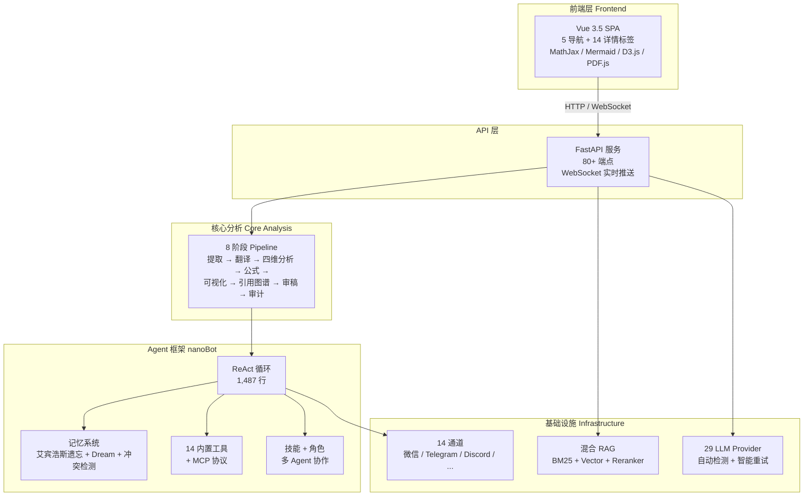
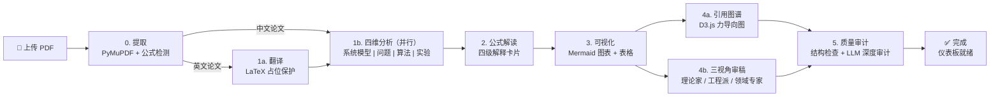

<p align="center">
  
</p>

<h1 align="center">🔬 Silver Research Bot</h1>

<p align="center">
  <strong>上传一篇论文 PDF，几分钟内获得学术级的深度理解。</strong><br/>
  <sub>8 阶段全自动深度分析：提取 → 翻译 → 四维分析 → 公式解读 → 可视化 → 引用图谱 → 审稿 → 审计</sub>
</p>

<p align="center">
  <a href="https://github.com/HKUDS/silver-research-bot/stargazers">
    
  </a>
  <a href="https://pypi.org/project/silver-research-bot-ai/">
    
  </a>
  
  
  
  <a href="https://silver-research-bot.wiki">
    
  </a>
</p>

---

## 🚀 快速开始

```bash
pip install silver-research-bot-ai
cp .env.example .env          # 编辑填入 API Key
uvicorn silver_research_bot.research_app:app --port 8765
```

**源码安装：**

```bash
git clone https://github.com/HKUDS/silver-research-bot
cd silver_research_bot
pip install -e ".[dev]"
cp .env.example .env
uvicorn silver_research_bot.research_app:app --reload --port 8765
```

**启动前端：**

```bash
cd web && npm install && npm run dev
# 浏览器访问 http://localhost:5173
```

**Docker 部署：**

```bash
docker build -t silver-research-bot .
docker run -p 8765:8765 --env-file .env silver-research-bot
```

---

## 🎬 演示


- **5 个导航标签**：Agent 对话 | 论文研读 | 文献 RAG | 阅读历史 | 研究趋势
- **14 个详情标签**：翻译 / 系统模型 / 问题表述 / 优化算法 / 实验设计 / 公式解读 / 可视化 / 引用图谱 / 审稿 / 审计 / PDF 阅读器 / 问答 / 对比 / 导出
- **3 个 D3.js 图表**：柱状图 + 热力图 + 折线图，展示研究趋势
- **i18n 国际化**：中文 / English 一键切换

---

## 🧩 功能全景

### 论文分析（8 阶段 Pipeline）

1. **PDF 提取** — PyMuPDF 深度解析，原图无损提取（xref），80+ Unicode→LaTeX 映射，5 规则公式过滤器。[文档](https://silver-research-bot.wiki/research-assistant)
2. **LaTeX 保护翻译** — 英文论文翻译为中文，`<FORMULA_i>` 占位符保护每个公式，译后重建——数学符号零损坏。[文档](https://silver-research-bot.wiki/research-assistant)
3. **四维并行分析** — `asyncio.gather` 并发执行：系统模型 | 问题表述 | 优化算法 | 实验设计，四维度同时深度分析。[文档](https://silver-research-bot.wiki/research-assistant)
4. **公式解读卡片** — 批量 LLM 生成四级 HTML 解释卡片：符号定义 → 数学含义 → 领域语境 → 关联关系。[文档](https://silver-research-bot.wiki/research-assistant)
5. **Mermaid 可视化** — 自动生成架构图、流程图、实验对比表格，程序化卡片渲染。[文档](https://silver-research-bot.wiki/research-assistant)
6. **引用图谱** — LLM 提取参考文献 → D3.js 力导向交互网络，4 类节点（论文/基础/对比/背景）。[文档](https://silver-research-bot.wiki/research-assistant)
7. **三视角审稿** — 理论家 | 工程派 | 领域专家，三个视角并行独立评审。[文档](https://silver-research-bot.wiki/research-assistant)
8. **质量审计** — 结构完整性检查 + LLM 深度审计，严重/一般/建议三级分级，可视化仪表板。[文档](https://silver-research-bot.wiki/research-assistant)

### 自主研究引擎

1. **自然语言→代码** — 用中文或英文描述实验意图，自动生成可执行的 Python 代码
2. **沙箱执行** — `subprocess` 安全执行，超时控制 + 完整日志记录
3. **指标提取** — 自动从 stdout 解析准确率、损失、F1 等关键指标
4. **LaTeX 论文草稿** — 基于真实实验数据，自动生成 Introduction / Method / Results / Discussion 论文草稿
5. **批量实验** — 多 seed、多 epoch 网格搜索，含完整审计追踪

### Agent 框架（nanoBot 核心）

1. **ReAct 循环** — 1,487 行推理-执行核心：LLM ↔ 工具交替调用 + 中轮消息注入 + 崩溃自动恢复 + 流式输出
2. **艾宾浩斯记忆** — 遗忘曲线 `R = e^(-t/S)`，7 天半衰期，1-10 重要性评分，语义冲突检测，Dream 后台整合
3. **14 个内置工具** — 论文搜索（arXiv/PubMed/SemanticScholar/DBLP 并行）、网页搜索、文件读写、子进程执行、MCP 协议客户端、定时任务、子代理生成等
4. **技能系统** — 技能热加载 + skill-creator 元技能，按需扩展 Agent 能力
5. **角色工厂** — 5 个预定义角色（论文审稿人/代码审阅/文献综述/翻译/公式专家）+ SOUL.md 自定义角色，每个角色绑定专属工具和 temperature
6. **多 Agent 协作** — PaperAnalysisTeam：翻译员 + 分析员 + 审计员通过异步 MessageBus 协同工作

### 混合 RAG 与基础设施

1. **BM25 + 向量 + 重排序** — 三级检索：0.3×BM25 + 0.7×向量加权融合 → Cross-Encoder 重排至 Top-5。[文档](https://silver-research-bot.wiki/research-assistant)
2. **29 个 LLM Provider** — OpenAI、Anthropic、DeepSeek、Gemini、Groq、Mistral、智谱 GLM、通义 Qwen、月之暗面 Kimi、MiniMax 等 29 家——自动检测 + 智能重试。[文档](https://silver-research-bot.wiki/configuration)
3. **零外部依赖** — 纯 numpy 文件向量存储，无需 Pinecone、Weaviate、Milvus 等外部向量数据库
4. **14 个聊天通道** — 微信、企业微信、钉钉、飞书、QQ、Telegram、Discord、Slack、WhatsApp、Matrix、MoChat、Email、MS Teams、WebSocket。[文档](https://silver-research-bot.wiki/chat-apps)
5. **Vue 3.5 前端** — 单文件 SPA，深色科技风设计，MathJax 3 / Mermaid 10 / D3.js v7 / PDF.js v3.11——全部 CDN 加载，零前端构建依赖

<details>
<summary>完整功能矩阵（点击展开）</summary>

| 阶段 | 功能 | 详细描述 | 产物 |
|------|------|----------|------|
| **0. 提取** | PDF 解析 | PyMuPDF 解析 + 原图提取（xref）+ 80+ Unicode→LaTeX + 5 规则公式过滤 | `extracted.json` |
| **1a. 翻译** | 分块翻译 | 2000 字/块 + `<FORMULA_i>` 占位符保护 + 动态 max_tokens + 2 级截断重试 | `translation.md` |
| **1b. 四维分析** | 并行深度分析 | `asyncio.gather` 并发：系统模型 \| 问题表述 \| 优化算法 \| 实验设计 | 4 个 `.md` 文件 |
| **2. 公式解读** | 四级解释卡片 | 批量 LLM 生成 HTML 卡片：符号定义 → 数学含义 → 领域语境 → 关联关系 | `formula_explanations.md` |
| **3. 可视化** | Mermaid 图表 | LLM 生成架构图 + 流程图 + 实验表格，程序化卡片渲染 | `analysis_visualization.html` |
| **4a. 引用图谱** | D3.js 力导向图 | LLM 提取引用 → 4 类节点 → D3.js 交互式渲染 | `citation_graph.html` |
| **4b. 三视角审稿** | A/B 审稿 | 理论家 \| 工程派 \| 领域专家 并行独立评审 | 3 个 `review_*.md` |
| **5. 质量审计** | 完整性检查 | 结构检查 + LLM 深度审计（严重/一般/建议分级）+ 可视化仪表板 | `audit_report.json` |

</details>

---

## 🤔 为什么选择 Silver Research Bot？

| ❌ 痛点 | ✅ Silver Research Bot 的解决方案 |
|---|---|
| ChatPDF / Claude 只能浅层总结论文，缺乏数学深度 | **8 阶段 Pipeline**：提取、翻译、四维并行分析、逐条公式解读、架构可视化、质量审计 |
| 读英文论文（ML、无人机、通信等）每篇需要数小时 | **LaTeX 保护翻译**：每个公式保留为 `$...$` / `$$...$$` 格式，译后重建——数学符号不损坏 |
| PDF 公式提取常遗漏行内数学、多行方程、编码字符 | **5 规则公式过滤器** + 边界扩展 + 80+ Unicode→LaTeX 映射 + 双下标合并 |
| 想对比 3+ 篇论文，但手动交叉引用太繁琐 | **LLM 增强横向对比** + D3.js 力导向引用图谱（论文/基础/对比/背景四类节点） |
| 想复现论文算法，但缺少实现时间 | **自主研究引擎**：自然语言描述 → 代码生成 → CPU 执行 → 指标提取 → LaTeX 论文草稿 |
| 需要在中国消息平台（微信、钉钉、飞书）上部署 AI Agent | **14 个内置聊天通道**：微信、企业微信、钉钉、飞书、QQ + Telegram、Discord、Slack、WhatsApp 等 |
| 构建有持久记忆的 AI Agent 基础设施复杂 | **完整 nanoBot Agent 框架**：ReAct 循环、艾宾浩斯遗忘曲线（7 天半衰期）、Dream 整合、冲突检测、Git 版本化记忆 |

---

## 🏗 架构图



<details>
<summary>Pipeline 流程图（点击展开）</summary>



</details>

---

## 📊 数据一览

| 指标 | 数值 |
|------|------|
| **论文分析深度** | 8 个阶段，非单一摘要 |
| **分析维度** | 4 维并行（系统模型 / 问题 / 算法 / 实验） |
| **审稿视角** | 3 视角并行（理论家 / 工程派 / 领域专家） |
| **LLM Provider** | 29 家（OpenAI / Anthropic / DeepSeek / 智谱 / 通义 / Kimi / Gemini / Groq / Mistral + 21 更多） |
| **聊天通道** | 14 个（微信 / 企业微信 / 钉钉 / 飞书 / QQ / Telegram / Discord / Slack / WhatsApp / Matrix / MoChat / Email / MS Teams / WebSocket） |
| **内置 Agent 工具** | 14 + MCP 协议支持 |
| **记忆半衰期** | 7 天（艾宾浩斯曲线：R = e^(-t/S)） |
| **RAG 检索** | BM25 + Vector + Cross-Encoder 三级混合 |
| **前端依赖** | 0（全部 CDN：MathJax / Mermaid / D3.js / PDF.js） |
| **API 端点** | 80+（论文 / RAG / 研究实验 / Agent / 趋势 / 历史） |
| **Python 代码量** | ~44,000 行，135+ 模块 |
| **文档站点** | [silver-research-bot.wiki](https://silver-research-bot.wiki) |

---

## 📦 安装与配置

### 配置层级

| 层级 | 位置 | 用途 |
|------|------|------|
| **API Key** | `.env` 文件（`cp .env.example .env`） | `DEEPSEEK_API_KEY`、`OPENAI_API_KEY` 等 |
| **全局默认值** | `config/schema.py` | Pydantic 模型，`env_prefix=silver_research_bot_` |
| **用户配置** | `~/.silver_research_bot/config.json` | 模型、记忆、RAG、通道设置 |
| **环境变量覆盖** | `silver_research_bot_<SECTION>__<FIELD>` | 嵌套覆盖 |
| **CLI** | `--config`、`--port`、`--workspace` | 运行时覆盖 |

配置模板：`config.example.json`（144 行，完整注释）

---

## 🔌 API 参考

| 分组 | 关键端点 |
|------|---------|
| **论文分析** | `POST /api/paper/upload` `GET /api/paper/{id}` `GET /api/paper/{id}/progress` `GET /api/paper/{id}/export` `POST /api/paper/{id}/ask` `DELETE /api/paper/{id}` |
| **横向对比** | `POST /api/paper/compare` |
| **实时推送** | `WS /api/paper/{id}/stream`（WebSocket） |
| **文献 RAG** | `POST /api/rag/search` `POST /api/rag/context` `GET /api/rag/papers` `POST /api/rag/papers` `POST /api/rag/reindex` |
| **研究实验** | `POST /api/research/run` `POST /api/research/run/{id}/execute` `POST /api/research/batch` `GET /api/research/compare` |
| **阅读历史** | `GET /api/history/events` `POST /api/paper/{id}/bookmark` `POST /api/paper/{id}/notes` `GET /api/trends` |
| **Agent 对话** | `POST /api/agent/chat` |
| **系统** | `GET /api/health` |

> 完整 API 文档：[silver-research-bot.wiki](https://silver-research-bot.wiki)

---

## 🛠 技术栈

| 层 | 技术 | 说明 |
|------|------|------|
| **后端框架** | FastAPI + Uvicorn | 异步 HTTP + WebSocket |
| **语言** | Python 3.11+ | asyncio 原生异步 |
| **PDF 解析** | PyMuPDF | 文本 + 原图提取 + 公式检测 |
| **前端框架** | Vue 3.5 + Vite 6 | Options API，单文件 SPA |
| **数学渲染** | MathJax 3（CDN） | LaTeX 公式渲染 |
| **图表渲染** | Mermaid 10（CDN） | 架构图、流程图 |
| **数据可视化** | D3.js v7（CDN） | 力导向图、热力图、折线图 |
| **PDF 阅读器** | PDF.js v3.11（CDN） | 双栏同步滚动 |
| **设计系统** | 深色科技风 CSS | CSS 变量 + Grid 布局 + Glow 特效 |
| **模板引擎** | Jinja2 | Prompt 模板渲染 |
| **日志** | Loguru | 结构化日志 |
| **测试** | pytest + httpx | 单元 + 集成 + E2E |
| **配置** | Pydantic Settings | 类型安全配置 |
| **LLM SDK** | openai / anthropic | 多 Provider 统一接口 |

---

## 📚 文档

完整文档：[silver-research-bot.wiki](https://silver-research-bot.wiki)

| 文档 | 内容 |
|------|------|
| [快速开始](https://silver-research-bot.wiki/quick-start) | 安装与第一篇论文分析 |
| [配置指南](https://silver-research-bot.wiki/configuration) | 完整 1062 行配置参考 |
| [研究助手](https://silver-research-bot.wiki/research-assistant) | 论文分析工作流详解 |
| [记忆系统](https://silver-research-bot.wiki/memory) | 遗忘曲线、Dream、冲突检测 |
| [通道插件](https://silver-research-bot.wiki/channel-plugin-guide) | 自定义聊天通道开发 |
| [聊天应用](https://silver-research-bot.wiki/chat-apps) | 多平台部署指南 |
| [Python SDK](https://silver-research-bot.wiki/python-sdk) | 编程式 API 调用 |
| [WebSocket](https://silver-research-bot.wiki/websocket) | 实时流式传输 |
| [部署指南](https://silver-research-bot.wiki/deployment) | Docker / systemd / 生产部署 |
| [CLI 参考](https://silver-research-bot.wiki/cli-reference) | 命令行接口 |

---

## ⭐ Star 历史

[](https://star-history.com/#HKUDS/silver-research-bot&Date)

---

## 🤝 社区与贡献

贡献前请阅读 [AGENTS.md](AGENTS.md)，了解编码规范、模块概览、数据流和已知问题。

- **Bug 报告**：[GitHub Issues](https://github.com/HKUDS/silver-research-bot/issues)
- **功能建议**：[GitHub Discussions](https://github.com/HKUDS/silver-research-bot/discussions)
- **使用问题**：[silver-research-bot.wiki](https://silver-research-bot.wiki)

Silver Research Bot 由 HKUDS 团队活跃开发中。当前重点方向：
- 公式提取强化（v0.6.1+）
- 跨论文对比深度
- 评测指标与基准

---

## 📄 许可证与引用

MIT License — 详见 [LICENSE](LICENSE) 文件。

如果你在研究中使用了 Silver Research Bot，请引用：

```bibtex
@software{silver_research_bot,
  author       = {HKUDS},
  title        = {Silver Research Bot: Autonomous AI Research Assistant with Multi-Stage Paper Analysis},
  year         = {2026},
  url          = {https://github.com/HKUDS/silver-research-bot},
  note         = {MIT License}
}
```

---

## 📁 项目结构

<details>
<summary>点击展开完整目录树</summary>

```
silver_research_bot/
├── research_app.py                ← FastAPI 主应用（80+ API 端点）
├── research_core.py               ← 通用科研实验引擎
├── research_cli.py                ← CLI 入口
├── research_service.py            ← 业务服务层
├── research_workflow.py           ← 工作流编排
│
├── paper_analyzer/                ← ★ 核心：论文分析子系统
│   ├── orchestrator.py            ← 8 阶段 Pipeline 编排器
│   ├── extractor.py               ← PDF 解析 + 公式检测
│   ├── translator.py              ← LaTeX 保护分块翻译
│   ├── analyzer.py                ← 四维并行分析
│   ├── formula_explainer.py       ← 四级公式解读
│   ├── visualizer.py              ← Mermaid 图表生成
│   ├── citation_graph.py          ← D3.js 引用图谱
│   ├── reviewer.py                ← 三视角 A/B 审稿
│   ├── auditor.py                 ← 质量审计
│   ├── reproducer.py              ← 算法复现
│   ├── manager.py                 ← PaperManager CRUD
│   ├── models.py                  ← 数据模型
│   └── tools.py                   ← 分析工具
│
├── agent/                         ← ★ nanoBot Agent 框架
│   ├── loop.py                    ← ReAct 循环（1,487 行）
│   ├── runner.py                  ← AgentRunner
│   ├── context.py                 ← ContextBuilder
│   ├── memory.py                  ← 记忆系统（1,140 行）
│   ├── autocompact.py             ← 自动压缩
│   ├── hook.py                    ← 钩子系统
│   ├── skills.py                  ← 技能加载
│   ├── subagent.py                ← 子代理管理
│   ├── paper_team.py              ← 三 Agent 协作
│   ├── role_factory.py            ← 5 角色 + SOUL.md
│   ├── memory_scorer.py           ← LLM 重要性评分
│   ├── memory_conflict.py         ← 语义冲突检测
│   ├── memory_retrieval.py        ← 主动记忆检索
│   ├── memory_forgetting.py       ← 艾宾浩斯遗忘曲线
│   └── tools/                     ← 14 个内置工具
│       ├── paper_search.py        ← 学术搜索引擎
│       ├── web.py                 ← Web 搜索 + 抓取
│       ├── filesystem.py          ← 文件系统操作
│       ├── shell.py               ← 子进程执行
│       ├── spawn.py               ← 子代理生成
│       ├── cron.py                ← 定时任务
│       ├── mcp.py                 ← MCP 协议客户端
│       └── ...
│
├── providers/                     ← LLM Provider 层（29 个）
│   ├── base.py                    ← Provider ABC（980 行）
│   ├── openai_compat_provider.py  ← OpenAI 兼容（30+ 提供商共用）
│   ├── anthropic_provider.py      ← Anthropic Provider
│   ├── registry.py                ← Provider 注册与自动检测
│   └── ...
│
├── channels/                      ← 多渠道接入（14 个）
│   ├── weixin.py / wecom.py / dingtalk.py / feishu.py
│   ├── telegram.py / discord.py / slack.py / whatsapp.py
│   └── ...
│
├── config/                        ← 配置系统
├── bus/                           ← 消息总线
├── session/                       ← 会话管理
├── templates/                     ← Prompt 模板（14+）
├── skills/                        ← 内置技能
├── utils/                         ← 工具函数（12 模块）
├── cli/                           ← CLI 交互
└── api/                           ← API 服务端

web/                               ← 前端 SPA
└── src/
    ├── main.js                    ← Vue 挂载入口
    ├── App.vue                    ← 单文件 SPA（~1,500 行）
    └── style.css                  ← 深色科技风（~800 行）
```
</details>
