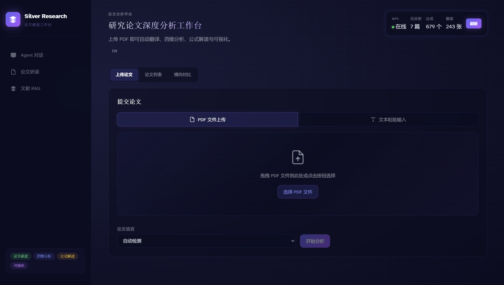
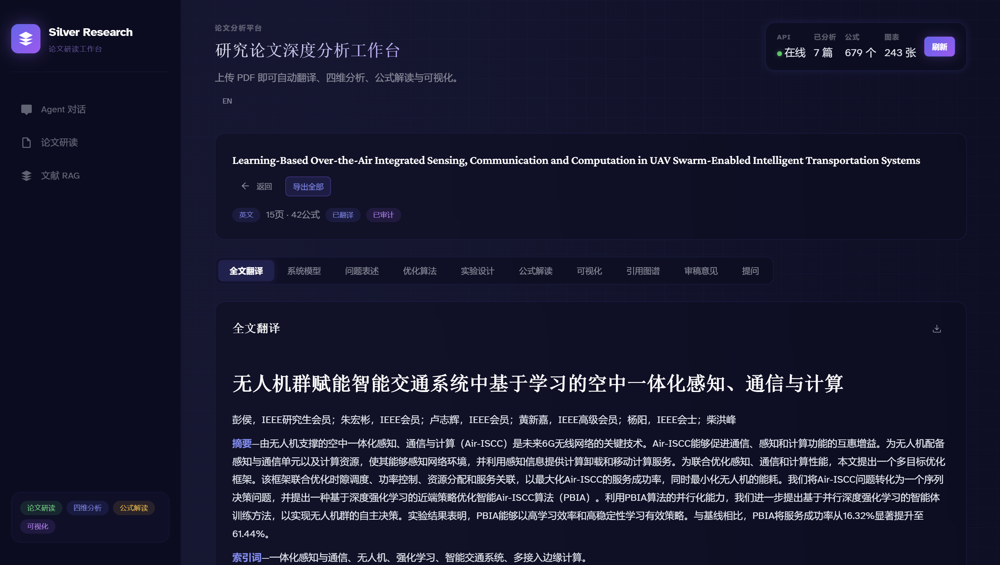
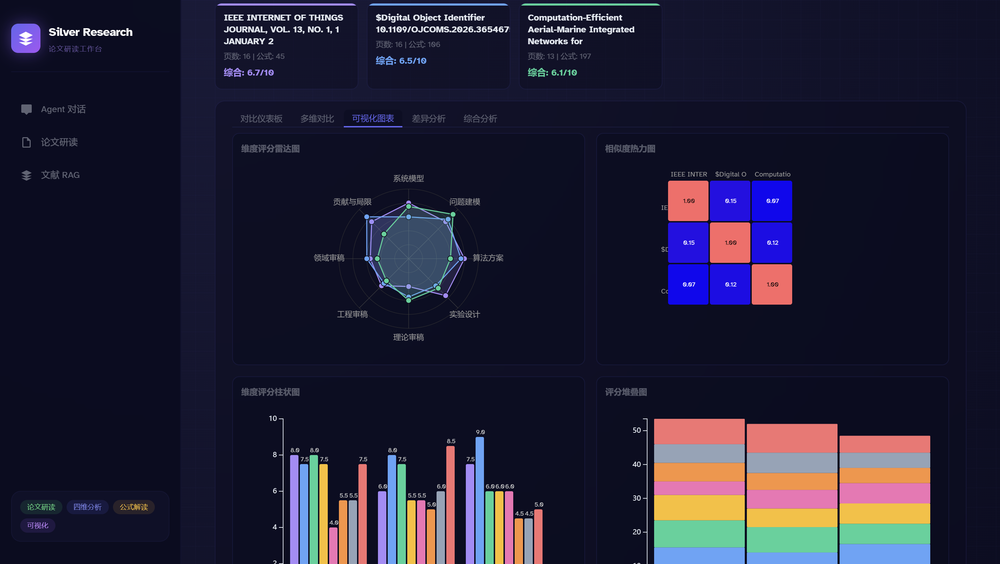
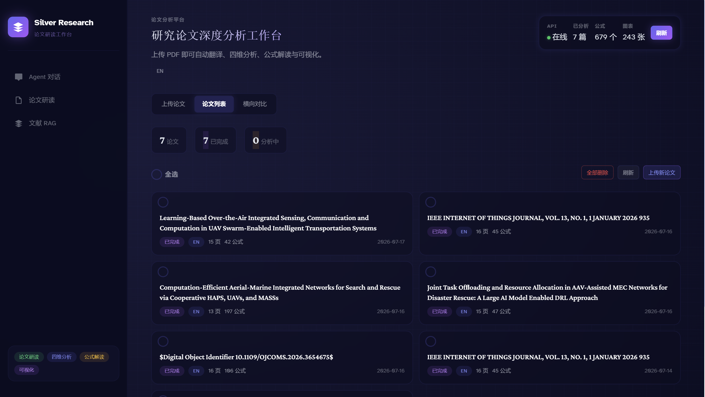
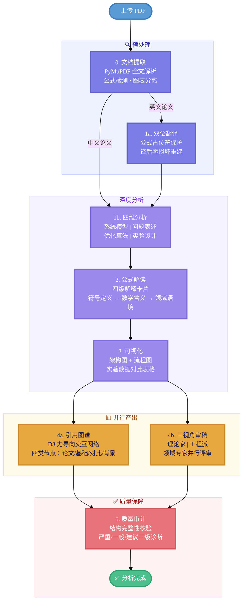
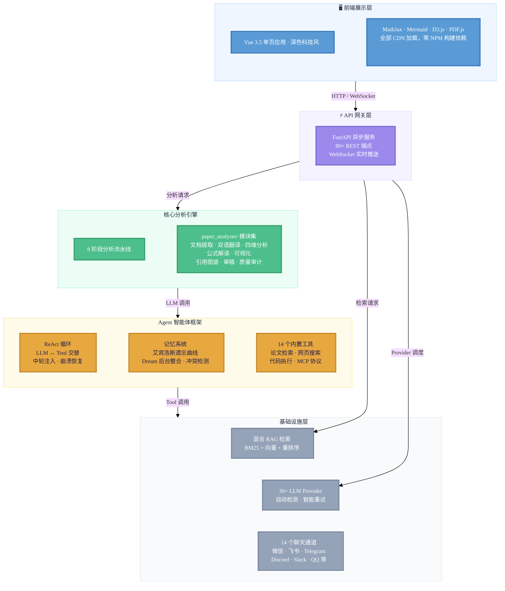

<p align="center">
  <strong style="font-size: 2em;">🔬 Silver Research Bot</strong><br/>
  <sub>AI 论文研读助手 · Paper Deep-Reading Agent</sub>
</p>

<p align="center">
  <a href="https://github.com/HKUDS/silver-research-bot/stargazers"></a>
  <a href="https://pypi.org/project/silver-research-bot-ai/"></a>
  
  
  <a href="https://silver-research-bot.wiki"></a>
  <a href="https://discord.gg/your-invite"></a>
</p>

---

## 📸 功能预览

<p align="center">
  &nbsp;
  
</p>

<p align="center">
  &nbsp;
  
</p>

---

## 🚀 快速开始

```bash
pip install silver-research-bot-ai
cp .env.example .env              # 填入 API Key（兼容 OpenAI / DeepSeek / 智谱 等任意接口）
uvicorn silver_research_bot.research_app:app --port 8765
```

浏览器打开 `http://localhost:8765`，拖入 PDF 即可启动 8 阶段全自动分析。

<details>
<summary>源码安装 · Docker 部署</summary>

```bash
# 源码安装
git clone https://github.com/HKUDS/silver-research-bot && cd silver_research_bot
pip install -e ".[dev]" && cp .env.example .env
uvicorn silver_research_bot.research_app:app --reload --port 8765

# Docker
docker build -t silver-research-bot .
docker run -p 8765:8765 --env-file .env silver-research-bot
```
</details>

---

## ✨ 核心能力

### 8 阶段论文深度分析

1. **PDF 提取** — PyMuPDF 解析，原图无损提取，80+ Unicode→LaTeX 自动转换
2. **LaTeX 保护翻译** — 英文→中文翻译，`<FORMULA_i>` 占位符保护每个公式，译后零损坏重建
3. **四维并行分析** — 系统模型 / 问题表述 / 优化算法 / 实验设计，`asyncio.gather` 同时深度解读
4. **公式解读** — 逐条 LLM 生成四级卡片：符号定义 → 数学含义 → 领域语境 → 关联关系
5. **Mermaid 可视化** — 自动生成架构图、流程图、实验对比表格
6. **引用图谱** — LLM 提取参考文献 → D3.js 力导向交互网络（论文/基础/对比/背景四类节点）
7. **三视角审稿** — 理论家 / 工程派 / 领域专家并行独立评审
8. **质量审计** — 结构完整性 + LLM 深度审计，严重/一般/建议三级可视化仪表板

### Agent 与检索基础设施

1. **ReAct Agent** — LLM ↔ 工具交替调用，中轮注入，崩溃自动恢复，流式输出
2. **艾宾浩斯记忆** — `R = e^(-t/S)` 遗忘曲线，7 天半衰期，语义冲突检测，Dream 后台整合
3. **混合 RAG** — BM25 + 向量 + Cross-Encoder 三级检索，支持公式/图表/表格多模态过滤
4. **多 Agent 协作** — 翻译员 + 分析员 + 审计员通过异步 MessageBus 协同工作
5. **30+ LLM Provider** — OpenAI · Anthropic · DeepSeek · 智谱 · 通义 · Kimi · Gemini · Groq 等，自动检测 + 智能重试
6. **14 个聊天通道** — 微信 · 企业微信 · 钉钉 · 飞书 · QQ · Telegram · Discord · Slack · WhatsApp · Matrix · MoChat · Email · MS Teams · WebSocket

---

## 🎯 使用场景

| 角色 | 怎么用 |
|------|--------|
| **研究生** | 每周组会前快速精读 3-5 篇论文，翻译 + 公式解读 + 可视化，节省 80% 阅读时间 |
| **博士后 / 青年教师** | 文献综述阶段批量分析，横向对比模块自动生成方法谱系和指标排行榜 |
| **导师** | 快速评估学生推荐的论文质量，通过多视角审稿发现方法论漏洞 |
| **企业研究员** | 追踪竞品论文，RAG 检索 + Agent 对话辅助技术调研和方案设计 |

---

## 🔄 分析流程



> 英文论文走翻译→分析路径，中文论文跳过翻译直接进入四维分析。4a/4b 并行执行后在审计阶段汇合。

---

## 🏗 架构概览



---

## 🔁 Agent 循环详解

Agent 核心 ReAct 循环的完整执行流程，包括消息总线、会话恢复、上下文构建、五步治理、工具执行、检查点和中轮注入：

```mermaid
%%{init: {'theme':'base', 'themeVariables': { 'fontSize':'13px','fontFamily':'system-ui, sans-serif' }}}%%
flowchart TD
    BUS["📨 MessageBus.consume_inbound()"]:::entry --> LOAD

    subgraph SESSION["💾 会话恢复"]
        LOAD["加载 / 创建 Session"]:::session
        CKPT{"有运行时检查点？"}:::decision
        RESTORE["恢复未完成的消息<br/>assistant + 工具结果 + 报错占位符<br/>去重融合避免重复"]:::session
        PENDING{"有 pending_user_turn？"}:::decision
        APOLOGY["追加道歉消息<br/>避免用户消息被吞"]:::session
        LOAD --> CKPT
        CKPT -->|"是"| RESTORE
        CKPT -->|"否"| PENDING
        RESTORE --> PENDING
        PENDING -->|"是"| APOLOGY
        PENDING -->|"否"| BUILD
        APOLOGY --> BUILD
    end

    BUILD["🏗 ContextBuilder.build_messages()"]:::context

    subgraph CTX["📋 上下文组装"]
        SYS["System Prompt<br/>身份 · 引导文件 · 记忆<br/>技能 · 近期历史"]:::context
        SUM{"AutoCompact<br/>空闲会话摘要？"}:::decision
        INJECT["注入会话摘要<br/>「已离开 X 分钟<br/>之前聊了...」"]:::context
        BUILD --> SYS
        SYS --> SUM
        SUM -->|"有摘要"| INJECT
        SUM -->|"无"| CONS
        INJECT --> CONS
    end

    CONS{"Consolidator<br/>Token 超预算？"}:::decision
    COMPRESS["LLM 压缩旧消息块 → 摘要<br/>归档 history.jsonl<br/>更新 last_consolidated 游标"]:::compress
    CONS -->|"是"| COMPRESS
    CONS -->|"否"| LOOP_START
    COMPRESS --> LOOP_START

    LOOP_START(["🔄 ReAct 循环开始<br/>iteration = 0"]):::loop

    subgraph GOVERN["🧹 五步上下文治理（每轮 LLM 调用前）"]
        direction TB
        G1["1️⃣ 清理孤儿结果<br/>移除无对应 tool_calls 的 tool 消息"]:::govern
        G2["2️⃣ 缺失回填<br/>为已有 tool_calls 补占位符结果"]:::govern
        G3["3️⃣ 微压缩<br/>只读工具结果 > 500 字符<br/>保留最近 10 条，其余替换占位符"]:::govern
        G4["4️⃣ 工具结果截断<br/>单个结果不超过 max_tool_result_chars"]:::govern
        G5["5️⃣ 历史窗口裁剪<br/>Token 仍超限时裁剪最旧消息"]:::govern
        G1 --> G2 --> G3 --> G4 --> G5
    end

    LLM["🤖 LLM 调用<br/>Provider.chat_with_retry()<br/>自动重试 · 错误分类 · 图片降级"]:::llm

    CHECK_RESP{"LLM 返回类型？"}:::decision

    subgraph TOOLS["🔧 工具执行"]
        SAVE_CKPT1["保存检查点<br/>phase: awaiting_tools"]:::checkpoint
        EXEC["并行 / 串行执行工具<br/>重复调用拦截（同签名 > 3 次阻断）<br/>白名单 · 超时 · 沙箱"]:::tools
        SAVE_CKPT2["保存检查点<br/>phase: tools_completed"]:::checkpoint
        DRAIN1{"中轮注入？"}:::decision
        SAVE_CKPT1 --> EXEC --> SAVE_CKPT2 --> DRAIN1
    end

    subgraph FINAL["✅ 最终回复处理"]
        EMPTY{"内容为空？"}:::decision
        RETRY_EMPTY["空响应重试<br/>最多 2 次"]:::final
        LENGTH{"finish_reason=length？"}:::decision
        RETRY_LENGTH["追加「继续」指令<br/>最多 3 次"]:::final
        DRAIN2{"中轮注入？"}:::decision
        APPEND["追加 assistant 消息<br/>保存最终检查点<br/>phase: final_response"]:::final

        EMPTY -->|"是"| RETRY_EMPTY
        EMPTY -->|"否"| LENGTH
        RETRY_EMPTY -->|"未超限"| GOVERN
        RETRY_EMPTY -->|"超限"| DRAIN2
        LENGTH -->|"是"| RETRY_LENGTH
        LENGTH -->|"否"| DRAIN2
        RETRY_LENGTH -->|"未超限"| GOVERN
        RETRY_LENGTH -->|"超限"| DRAIN2
        DRAIN2 -->|"有注入"| GOVERN
        DRAIN2 -->|"无注入"| APPEND
    end

    ERROR_STOP["❌ 错误终止<br/>tool_error / error<br/>empty_final_response"]:::error

    LOOP_START --> GOVERN
    GOVERN --> LLM
    LLM --> CHECK_RESP
    CHECK_RESP -->|"有 tool_calls"| TOOLS
    CHECK_RESP -->|"无 tool_calls"| FINAL
    DRAIN1 -->|"有注入"| GOVERN
    DRAIN1 -->|"无注入"| GOVERN
    TOOLS -->|"致命错误"| ERROR_STOP

    APPEND --> DONE([✅ 循环结束])
    ERROR_STOP --> SAVE

    DONE --> SAVE["💾 _save_turn()<br/>持久化对话历史"]:::session
    SAVE --> PUB["📤 publish_outbound()<br/>发送响应到消息总线"]:::session

    MAX_ITER{"达到 max_iterations？"}:::decision
    CHECK_RESP -.->|"每轮检查"| MAX_ITER
    MAX_ITER -.->|"是 → 生成降级消息"| DONE

    classDef entry fill:#5b9bd5,stroke:#3b7abf,color:#fff,stroke-width:2.5px
    classDef session fill:#7c7de6,stroke:#5e5fc9,color:#fff,stroke-width:2.5px
    classDef context fill:#9b8aeb,stroke:#7b6ad4,color:#fff,stroke-width:2.5px
    classDef decision fill:#e8a840,stroke:#c68a2e,color:#1e1b4b,stroke-width:2px
    classDef compress fill:#e8737a,stroke:#cd5660,color:#fff,stroke-width:2.5px
    classDef loop fill:#4dbf8c,stroke:#35a06e,color:#fff,stroke-width:3px
    classDef govern fill:#94a3b8,stroke:#708098,color:#fff,stroke-width:2px
    classDef llm fill:#f59e0b,stroke:#d97706,color:#1e1b4b,stroke-width:2.5px
    classDef tools fill:#06b6d4,stroke:#0891b2,color:#fff,stroke-width:2.5px
    classDef checkpoint fill:#a78bfa,stroke:#7c3aed,color:#fff,stroke-width:2px
    classDef final fill:#10b981,stroke:#059669,color:#fff,stroke-width:2.5px
    classDef error fill:#ef4444,stroke:#dc2626,color:#fff,stroke-width:2.5px

    style SESSION fill:#eef2ff,stroke:#c7d2fe,color:#3730a3
    style CTX fill:#f5f3ff,stroke:#ddd6fe,color:#6d28d9
    style GOVERN fill:#f9fafb,stroke:#e5e7eb,color:#374151
    style TOOLS fill:#ecfeff,stroke:#a5f3fc,color:#155e75
    style FINAL fill:#ecfdf5,stroke:#a7f3d0,color:#065f46
```



> **关键防护机制**：① 重复工具调用拦截（同签名 > 3 次阻断） ② `max_iterations` 硬上限（默认 20） ③ 空响应重试（最多 2 次） ④ 输出截断续写（最多 3 次） ⑤ 中轮注入循环限制（最多 5 周期）。检查点在三个边界保存（工具调用前 / 工具完成后 / 最终回复），崩溃恢复时自动重建消息并去重融合。

---

## 🛠 技术栈

| 层 | 技术 |
|------|------|
| 后端 | Python 3.11+ · FastAPI · Uvicorn · PyMuPDF · httpx · loguru |
| 前端 | Vue 3.5 · Vite 6 · D3.js v7 · MathJax 3 · Mermaid 10 · PDF.js v3.11 |
| AI | 30+ LLM Provider，统一接口 + 自动重试 + 图片降级 |
| 存储 | 纯文件系统 — JSON + Markdown + pickle + numpy，零外部依赖 |

---

## 📚 文档

| 入门 | 进阶 | 开发 |
|------|------|------|
| [快速开始](https://silver-research-bot.wiki/quick-start) | [配置指南](https://silver-research-bot.wiki/configuration) | [Python SDK](https://silver-research-bot.wiki/python-sdk) |
| [用户指南](https://silver-research-bot.wiki/user-guide) | [记忆系统](https://silver-research-bot.wiki/memory) | [通道开发](https://silver-research-bot.wiki/channel-plugin-guide) |
| [研究助手](https://silver-research-bot.wiki/research-assistant) | [部署指南](https://silver-research-bot.wiki/deployment) | [API 参考](https://silver-research-bot.wiki/api) |

完整文档站：[silver-research-bot.wiki](https://silver-research-bot.wiki)

---

## ⭐ 社区

[](https://star-history.com/#HKUDS/silver-research-bot&Date)

- **Bug 报告**：[GitHub Issues](https://github.com/HKUDS/silver-research-bot/issues)
- **功能建议**：[GitHub Discussions](https://github.com/HKUDS/silver-research-bot/discussions)
- **贡献前请阅读**：[CLAUDE.md](CLAUDE.md)

---

## 📄 引用

```bibtex
@software{silver_research_bot,
  author  = {HKUDS},
  title   = {Silver Research Bot: AI-Powered Deep Paper Analysis Agent},
  year    = {2026},
  url     = {https://github.com/HKUDS/silver-research-bot},
  note    = {MIT License}
}
```

<p align="center">
  <sub>MIT License · Built with ❤️ by HKUDS</sub>
</p>
