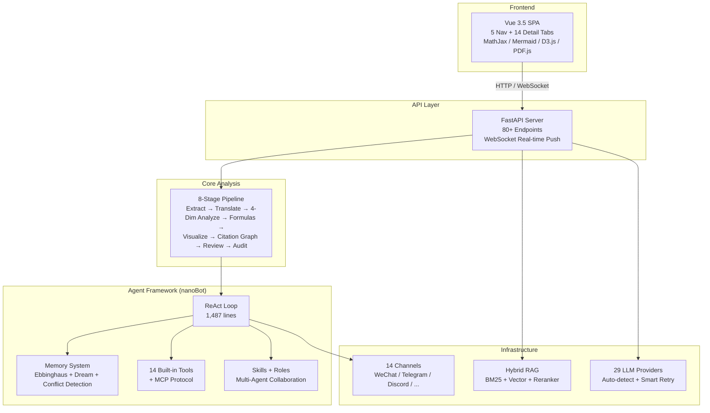
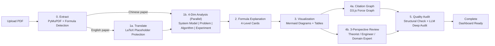

<p align="center">
  
</p>

<h1 align="center">Silver Research Bot</h1>

<p align="center">
  <strong>Upload a PDF, get scholarly-level understanding in minutes.</strong><br/>
  <sub>8-stage deep analysis: extract, translate, analyze, explain formulas, visualize, review, and audit — automatically.</sub>
</p>

<p align="center">
  <a href="https://github.com/HKUDS/silver-research-bot/stargazers">
    
  </a>
  <a href="https://pypi.org/project/silver-research-bot-ai/">
    
  </a>
  
  
  
  <a href="https://silver-research-bot.wiki">
    
  </a>
</p>

---

## Quick Start

```bash
pip install silver-research-bot-ai
cp .env.example .env          # edit in your API keys
uvicorn silver_research_bot.research_app:app --port 8765
```

**From source:**

```bash
git clone https://github.com/HKUDS/silver-research-bot
cd silver_research_bot
pip install -e ".[dev]"
cp .env.example .env
uvicorn silver_research_bot.research_app:app --reload --port 8765
```

**Frontend:**

```bash
cd web && npm install && npm run dev
# Open http://localhost:5173
```

**Docker:**

```bash
docker build -t silver-research-bot .
docker run -p 8765:8765 --env-file .env silver-research-bot
```

---

## Demo


- **5 navigation tabs**: Agent Chat | Paper Analysis | Literature RAG | Reading History | Research Trends
- **14 detail tabs**: Translation / System Model / Problem Formulation / Optimization Algorithm / Experiment Design / Formulas / Visualization / Citation Graph / Review / Audit / PDF Reader / Q&A / Compare / Export
- **3 D3.js charts**: Bar chart + Heatmap + Line chart for research trends
- **i18n**: Chinese / English toggle

---

## What Can Silver Research Bot Do?

### Paper Analysis (8-Stage Pipeline)

1. **PDF Extraction** — PyMuPDF parsing with original figure extraction, 80+ Unicode→LaTeX mapping, 5-rule formula detection. [Docs](https://silver-research-bot.wiki/research-assistant)
2. **LaTeX-Safe Translation** — Translate English papers while preserving every formula as `$$...$$` with chunk-level formula placeholders. [Docs](https://silver-research-bot.wiki/research-assistant)
3. **4-Dimension Parallel Analysis** — System model, problem formulation, optimization algorithm, and experiment design analyzed concurrently via `asyncio.gather`. [Docs](https://silver-research-bot.wiki/research-assistant)
4. **Formula Explanation Cards** — Four-level HTML cards: symbol definition, math meaning, domain context, and cross-formula relationships. [Docs](https://silver-research-bot.wiki/research-assistant)
5. **Mermaid Visualization** — Auto-generated architecture diagrams, flowcharts, and experiment tables. [Docs](https://silver-research-bot.wiki/research-assistant)
6. **Citation Graph** — D3.js force-directed interactive network with 4 node types (paper/foundation/comparison/background). [Docs](https://silver-research-bot.wiki/research-assistant)
7. **Three-Perspective Review** — Independent reviews from theorist, engineer, and domain expert viewpoints. [Docs](https://silver-research-bot.wiki/research-assistant)
8. **Quality Audit** — Structural integrity check plus LLM deep audit with severity grading (critical/general/suggestion). [Docs](https://silver-research-bot.wiki/research-assistant)

### Autonomous Research Engine

1. **Natural Language → Code** — Describe an experiment in plain English, get executable Python.
2. **Sandboxed Execution** — Safe `subprocess` execution with timeout and full logging.
3. **Metric Extraction** — Auto-parse accuracy, loss, F1, and more from stdout.
4. **LaTeX Draft Generation** — Generate paper drafts (Introduction/Method/Results/Discussion) from real experimental data.
5. **Batch Experiments** — Multi-seed, multi-epoch grid search with audit trails.

### Agent Framework (nanoBot Core)

1. **ReAct Loop** — 1,487-line reasoning-and-acting core with mid-turn injection, crash recovery, and streaming output.
2. **Ebbinghaus Memory** — Forgetting curve `R = e^(-t/S)` with 7-day half-life, 1-10 importance scoring, semantic conflict detection, and Dream background consolidation.
3. **14 Built-in Tools** — Paper search (arXiv/PubMed/SemanticScholar/DBLP), web search, filesystem, subprocess, MCP protocol client, cron, spawn, and more.
4. **Skill System** — Hot-loadable skills with a meta skill-creator for on-demand capability extension.
5. **Role Factory** — 5 predefined roles (paper_reviewer, code_reviewer, literature_review, translator, formula_expert) plus custom SOUL.md roles, each with dedicated tools and temperature.
6. **Multi-Agent Collaboration** — PaperAnalysisTeam: Translator + Analyzer + Auditor coordinated via async MessageBus.

### Hybrid RAG & Infrastructure

1. **BM25 + Vector + Reranker** — Three-stage retrieval: 0.3×BM25 + 0.7×vector weighted fusion → Cross-Encoder top-5 reranking. [Docs](https://silver-research-bot.wiki/research-assistant)
2. **29 LLM Providers** — OpenAI, Anthropic, DeepSeek, Gemini, Groq, Mistral, GLM, Qwen, Kimi, MiniMax, and 19 more — with auto-detection and smart retry. [Docs](https://silver-research-bot.wiki/configuration)
3. **Zero External Dependencies** — Pure numpy file-based vector store. No Pinecone, Weaviate, or Milvus needed.
4. **14 Chat Channels** — WeChat, WeCom, DingTalk, Feishu, QQ, Telegram, Discord, Slack, WhatsApp, Matrix, MoChat, Email, MS Teams, WebSocket. [Docs](https://silver-research-bot.wiki/chat-apps)
5. **Vue 3.5 Frontend** — Single-page app with dark sci-fi theme, MathJax 3, Mermaid 10, D3.js v7, PDF.js v3.11 — all via CDN, zero frontend build dependencies.

<details>
<summary>Complete feature matrix (expand)</summary>

| Stage | Function | Description | Output |
|------|----------|-------------|--------|
| **0. Extract** | PDF Parsing | PyMuPDF + original figure extraction (xref) + 80+ Unicode→LaTeX + 5-rule formula filter | `extracted.json` |
| **1a. Translate** | Chunked Translation | 2000 chars/chunk + `<FORMULA_i>` placeholder protection + dynamic max_tokens + 2-level truncation retry | `translation.md` |
| **1b. 4-Dim Analysis** | Parallel Deep Analysis | `asyncio.gather`: system model | problem formulation | optimization algorithm | experiment design | 4 `.md` files |
| **2. Formula Explain** | 4-Level Cards | Batch LLM HTML cards: symbol definition → math meaning → domain context → relationships | `formula_explanations.md` |
| **3. Visualize** | Mermaid Diagrams | LLM-generated architecture + flowchart + experiment tables, programmatic card rendering | `analysis_visualization.html` |
| **4a. Citation Graph** | D3.js Force Graph | LLM citation extraction → 4 node types → interactive D3.js rendering | `citation_graph.html` |
| **4b. 3-Perspective Review** | A/B Review | Theorist | Engineer | Domain Expert parallel independent reviews | 3 `review_*.md` |
| **5. Quality Audit** | Integrity Check | Structural check + LLM deep audit (critical/general/suggestion grading) + visual dashboard | `audit_report.json` |

</details>

---

## Why Silver Research Bot?

| Pain Point | Silver Research Bot Solution |
|---|---|
| ChatPDF / Claude only give shallow paper summaries, no math depth | **8-stage Pipeline**: extract, translate, 4-dim parallel analysis, per-formula explanation, architecture visualization, quality audit |
| Reading English papers (ML, UAV, communications, etc.) takes hours each | **LaTeX-preserving Translation**: every formula kept as `$...$` / `$$...$$`, reconstructed after translation — math survives intact |
| PDF formula extraction misses inline math, multi-line equations, encoded characters | **5-rule formula filter** + boundary expansion + 80+ Unicode→LaTeX mapping + double-subscript merging |
| Want to compare 3+ papers but manual cross-referencing is tedious | **LLM-enhanced cross-paper comparison** + D3.js force-directed citation graph (paper/foundation/comparison/background nodes) |
| Want to reproduce paper algorithms but lack implementation time | **Autonomous Research Engine**: natural language → code generation → CPU execution → metric extraction → LaTeX paper draft |
| Need AI Agent on Chinese messaging platforms (WeChat, DingTalk, Feishu) | **14 built-in chat channels**: WeChat, WeCom, DingTalk, Feishu, QQ + Telegram, Discord, Slack, WhatsApp, etc. |
| Building AI Agent infrastructure with persistent memory is complex | **Complete nanoBot Agent Framework**: ReAct loop, Ebbinghaus forgetting curve (7-day half-life), Dream consolidation, conflict detection, Git-versioned memory |

---

## Architecture



<details>
<summary>Pipeline flowchart (expand)</summary>



</details>

---

## By the Numbers

| Metric | Value |
|---|---|
| **Analysis Depth** | 8 stages, not a single summary |
| **Analysis Dimensions** | 4 parallel (system model / problem / algorithm / experiment) |
| **Review Perspectives** | 3 parallel (theorist / engineer / domain expert) |
| **LLM Providers** | 29 (OpenAI / Anthropic / DeepSeek / GLM / Qwen / Kimi / Gemini / Groq / Mistral + 21 more) |
| **Chat Channels** | 14 (WeChat / WeCom / DingTalk / Feishu / QQ / Telegram / Discord / Slack / WhatsApp / Matrix / MoChat / Email / MS Teams / WebSocket) |
| **Built-in Agent Tools** | 14 + MCP protocol support |
| **Memory Half-life** | 7 days (Ebbinghaus curve: R = e^(-t/S)) |
| **RAG Retrieval** | BM25 + Vector + Cross-Encoder 3-stage hybrid |
| **Frontend Dependencies** | 0 (all CDN: MathJax / Mermaid / D3.js / PDF.js) |
| **API Endpoints** | 80+ (papers / RAG / research experiments / agent / trends / history) |
| **Python Codebase** | ~44,000 lines, 135+ modules |
| **Documentation** | [silver-research-bot.wiki](https://silver-research-bot.wiki) |

---

## Installation & Configuration

### Configuration Layers

| Layer | Location | Purpose |
|---|---|---|
| **API Keys** | `.env` file (`cp .env.example .env`) | `DEEPSEEK_API_KEY`, `OPENAI_API_KEY`, etc. |
| **Global Defaults** | `config/schema.py` | Pydantic models, `env_prefix=silver_research_bot_` |
| **User Config** | `~/.silver_research_bot/config.json` | Model, memory, RAG, channel settings |
| **Env Var Override** | `silver_research_bot_<SECTION>__<FIELD>` | Nested override |
| **CLI** | `--config`, `--port`, `--workspace` | Runtime override |

Config template: `config.example.json` (144 lines, fully commented)

---

## API Reference

| Group | Key Endpoints |
|---|---|
| **Paper Analysis** | `POST /api/paper/upload` `GET /api/paper/{id}` `GET /api/paper/{id}/progress` `GET /api/paper/{id}/export` `POST /api/paper/{id}/ask` `DELETE /api/paper/{id}` |
| **Cross-paper Compare** | `POST /api/paper/compare` |
| **Real-time Push** | `WS /api/paper/{id}/stream` (WebSocket) |
| **Literature RAG** | `POST /api/rag/search` `POST /api/rag/context` `GET /api/rag/papers` `POST /api/rag/papers` `POST /api/rag/reindex` |
| **Research Experiments** | `POST /api/research/run` `POST /api/research/run/{id}/execute` `POST /api/research/batch` `GET /api/research/compare` |
| **Reading History** | `GET /api/history/events` `POST /api/paper/{id}/bookmark` `POST /api/paper/{id}/notes` `GET /api/trends` |
| **Agent Chat** | `POST /api/agent/chat` |
| **System** | `GET /api/health` |

> Full API docs: [silver-research-bot.wiki](https://silver-research-bot.wiki)

---

## Tech Stack

| Layer | Technology | Notes |
|---|---|---|
| **Backend Framework** | FastAPI + Uvicorn | Async HTTP + WebSocket |
| **Language** | Python 3.11+ | Native asyncio |
| **PDF Parsing** | PyMuPDF | Text + original figure extraction + formula detection |
| **Frontend Framework** | Vue 3.5 + Vite 6 | Options API, single-file SPA |
| **Math Rendering** | MathJax 3 (CDN) | LaTeX formula rendering |
| **Diagram Rendering** | Mermaid 10 (CDN) | Architecture diagrams, flowcharts |
| **Data Visualization** | D3.js v7 (CDN) | Force graph, heatmap, line chart |
| **PDF Reader** | PDF.js v3.11 (CDN) | Dual-column sync scroll |
| **Design System** | Dark sci-fi CSS | CSS variables + Grid layout + Glow effects |
| **Template Engine** | Jinja2 | Prompt template rendering |
| **Logging** | Loguru | Structured logging |
| **Testing** | pytest + httpx | Unit + integration + E2E |
| **Configuration** | Pydantic Settings | Type-safe configuration |
| **LLM SDK** | openai / anthropic | Multi-provider unified interface |

---

## Documentation

Full docs: [silver-research-bot.wiki](https://silver-research-bot.wiki)

| Doc | Content |
|---|---|
| [Quick Start](https://silver-research-bot.wiki/quick-start) | Installation and first paper analysis |
| [Configuration Guide](https://silver-research-bot.wiki/configuration) | Complete 1062-line config reference |
| [Research Assistant](https://silver-research-bot.wiki/research-assistant) | Paper analysis workflow details |
| [Memory System](https://silver-research-bot.wiki/memory) | Forgetting curve, Dream, conflict detection |
| [Channel Plugins](https://silver-research-bot.wiki/channel-plugin-guide) | Custom chat channel development |
| [Chat Apps](https://silver-research-bot.wiki/chat-apps) | Multi-platform deployment guide |
| [Python SDK](https://silver-research-bot.wiki/python-sdk) | Programmatic API access |
| [WebSocket](https://silver-research-bot.wiki/websocket) | Real-time streaming |
| [Deployment](https://silver-research-bot.wiki/deployment) | Docker / systemd / production |
| [CLI Reference](https://silver-research-bot.wiki/cli-reference) | Command-line interface |

---

## Star History

[](https://star-history.com/#HKUDS/silver-research-bot&Date)

---

## Community & Contributing

Read [AGENTS.md](AGENTS.md) before contributing — it covers coding conventions, module overview, data flow, and known pitfalls.

- **Bug reports**: [GitHub Issues](https://github.com/HKUDS/silver-research-bot/issues)
- **Feature suggestions**: [GitHub Discussions](https://github.com/HKUDS/silver-research-bot/discussions)
- **Questions**: [silver-research-bot.wiki](https://silver-research-bot.wiki)

Silver Research Bot is actively developed by the HKUDS team. Current focus areas:
- Formula extraction hardening (v0.6.1+)
- Cross-paper comparison depth
- Evaluation metrics and benchmarks

---

## License & Citation

MIT License — see [LICENSE](LICENSE).

If you use Silver Research Bot in your research, please cite:

```bibtex
@software{silver_research_bot,
  author       = {HKUDS},
  title        = {Silver Research Bot: Autonomous AI Research Assistant with Multi-Stage Paper Analysis},
  year         = {2026},
  url          = {https://github.com/HKUDS/silver-research-bot},
  note         = {MIT License}
}
```

---

## Project Structure

<details>
<summary>Click to expand directory tree</summary>

```
silver_research_bot/
├── research_app.py                ← FastAPI main app (80+ API endpoints)
├── research_core.py               ← General research experiment engine
├── research_cli.py                ← CLI entry point
├── research_service.py            ← Business service layer
├── research_workflow.py           ← Workflow orchestration
│
├── paper_analyzer/                ← ★ Core: paper analysis subsystem
│   ├── orchestrator.py            ← 8-stage pipeline orchestrator
│   ├── extractor.py               ← PDF parsing + formula detection
│   ├── translator.py              ← LaTeX-preserving chunked translation
│   ├── analyzer.py                ← 4-dim parallel analysis
│   ├── formula_explainer.py       ← 4-level formula explanation
│   ├── visualizer.py              ← Mermaid diagram generation
│   ├── citation_graph.py          ← D3.js citation graph
│   ├── reviewer.py                ← 3-perspective A/B review
│   ├── auditor.py                 ← Quality audit
│   ├── reproducer.py              ← Algorithm reproduction
│   ├── manager.py                 ← PaperManager CRUD
│   ├── models.py                  ← Data models
│   └── tools.py                   ← Analysis utilities
│
├── agent/                         ← ★ nanoBot Agent framework
│   ├── loop.py                    ← ReAct loop (1,487 lines)
│   ├── runner.py                  ← AgentRunner
│   ├── context.py                 ← ContextBuilder
│   ├── memory.py                  ← Memory system (1,140 lines)
│   ├── autocompact.py             ← Auto-compaction
│   ├── hook.py                    ← Hook system
│   ├── skills.py                  ← Skill loading
│   ├── subagent.py                ← Sub-agent management
│   ├── paper_team.py              ← 3-agent collaboration
│   ├── role_factory.py            ← 5 roles + SOUL.md
│   ├── memory_scorer.py           ← LLM importance scoring
│   ├── memory_conflict.py         ← Semantic conflict detection
│   ├── memory_retrieval.py        ← Proactive memory retrieval
│   ├── memory_forgetting.py       ← Ebbinghaus forgetting curve
│   └── tools/                     ← 14 built-in tools
│       ├── paper_search.py        ← Academic search engine
│       ├── web.py                 ← Web search + fetch
│       ├── filesystem.py          ← File system operations
│       ├── shell.py               ← Subprocess execution
│       ├── spawn.py               ← Sub-agent spawning
│       ├── cron.py                ← Scheduled tasks
│       ├── mcp.py                 ← MCP protocol client
│       └── ...
│
├── providers/                     ← LLM Provider layer (29 providers)
│   ├── base.py                    ← Provider ABC (980 lines)
│   ├── openai_compat_provider.py  ← OpenAI-compatible (30+ providers)
│   ├── anthropic_provider.py      ← Anthropic Provider
│   ├── registry.py                ← Provider registration + auto-detect
│   └── ...
│
├── channels/                      ← Multi-channel access (14 channels)
│   ├── weixin.py / wecom.py / dingtalk.py / feishu.py
│   ├── telegram.py / discord.py / slack.py / whatsapp.py
│   └── ...
│
├── config/                        ← Configuration system
├── bus/                           ← Message bus
├── session/                       ← Session management
├── templates/                     ← Prompt templates (14+)
├── skills/                        ← Built-in skills
├── utils/                         ← Utility functions (12 modules)
├── cli/                           ← CLI interaction
└── api/                           ← API server

web/                               ← Frontend SPA
└── src/
    ├── main.js                    ← Vue mount entry
    ├── App.vue                    ← Single-file SPA (~1,500 lines)
    └── style.css                  ← Dark sci-fi theme (~800 lines)
```
</details>
