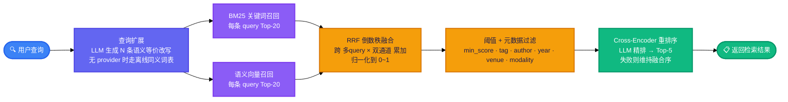

## 检索路由策略

```mermaid
%%{init: {'theme':'base', 'themeVariables': { 'fontSize':'13px','fontFamily':'system-ui, sans-serif' }}}%%
flowchart LR
    Q(["🔍 用户查询"]):::entry --> EXPAND["查询扩展<br/>LLM 生成 N 条语义等价改写<br/>无 provider 时走离线同义词表"]:::process

    EXPAND --> BM25["BM25 关键词召回<br/>每条 query Top-20"]:::analysis
    EXPAND --> VEC["语义向量召回<br/>每条 query Top-20"]:::analysis

    BM25 --> FUSE["RRF 倒数秩融合<br/>跨 多query × 双通道 累加<br/>归一化到 0~1"]:::output
    VEC --> FUSE

    FUSE --> FILTER["阈值 + 元数据过滤<br/>min_score · tag · author · year · venue · modality"]:::output

    FILTER --> RERANK["Cross-Encoder 重排序<br/>LLM 精排 → Top-5<br/>失败则维持融合序"]:::done
    RERANK --> RESULT(["📋 返回检索结果"]):::done

    classDef entry fill:#3b82f6,stroke:#2563eb,color:#fff,stroke-width:2px
    classDef process fill:#6366f1,stroke:#4f46e5,color:#fff,stroke-width:2px
    classDef analysis fill:#8b5cf6,stroke:#7c3aed,color:#fff,stroke-width:2px
    classDef output fill:#f59e0b,stroke:#d97706,color:#1e1b4b,stroke-width:2px
    classDef done fill:#10b981,stroke:#059669,color:#fff,stroke-width:2px
```
