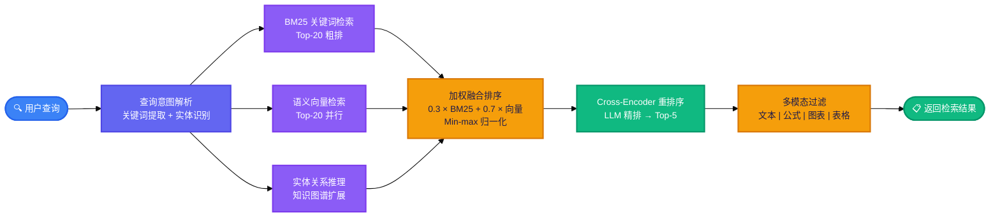

## 检索路由策略

```mermaid
%%{init: {'theme':'base', 'themeVariables': { 'fontSize':'13px','fontFamily':'system-ui, sans-serif' }}}%%
flowchart LR
    Q(["🔍 用户查询"]):::entry --> PARSE["查询意图解析<br/>关键词提取 + 实体识别"]:::process

    PARSE --> BM25["BM25 关键词检索<br/>Top-20 粗排"]:::analysis
    PARSE --> VEC["语义向量检索<br/>Top-20 并行"]:::analysis
    PARSE --> KG["实体关系推理<br/>知识图谱扩展"]:::analysis

    BM25 --> FUSE["加权融合排序<br/>0.3 × BM25 + 0.7 × 向量<br/>Min-max 归一化"]:::output
    VEC --> FUSE
    KG --> FUSE

    FUSE --> RERANK["Cross-Encoder 重排序<br/>LLM 精排 → Top-5"]:::done

    RERANK --> FILTER["多模态过滤<br/>文本 | 公式 | 图表 | 表格"]:::output
    FILTER --> RESULT(["📋 返回检索结果"]):::done

    classDef entry fill:#3b82f6,stroke:#2563eb,color:#fff,stroke-width:2px
    classDef process fill:#6366f1,stroke:#4f46e5,color:#fff,stroke-width:2px
    classDef analysis fill:#8b5cf6,stroke:#7c3aed,color:#fff,stroke-width:2px
    classDef output fill:#f59e0b,stroke:#d97706,color:#1e1b4b,stroke-width:2px
    classDef done fill:#10b981,stroke:#059669,color:#fff,stroke-width:2px
```
